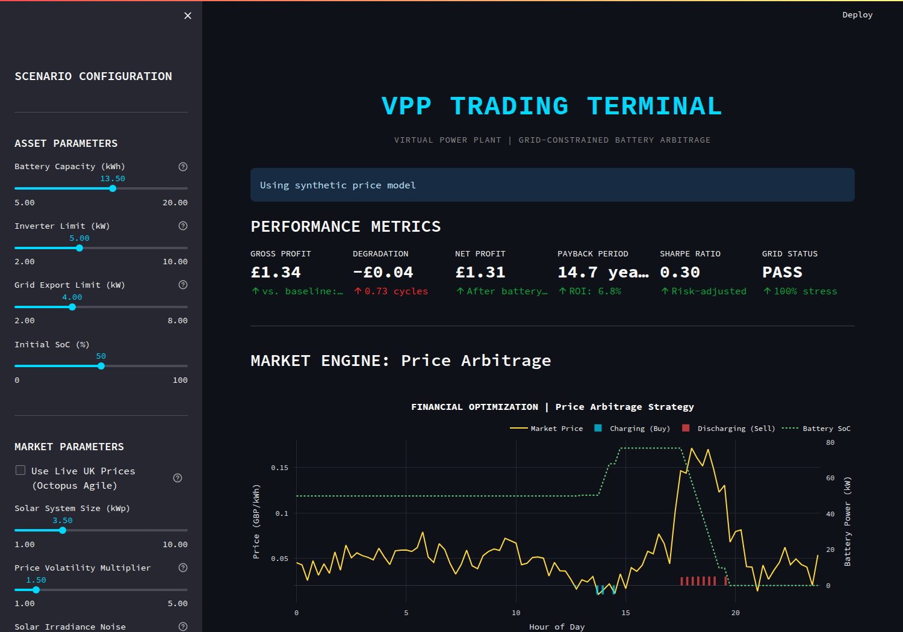
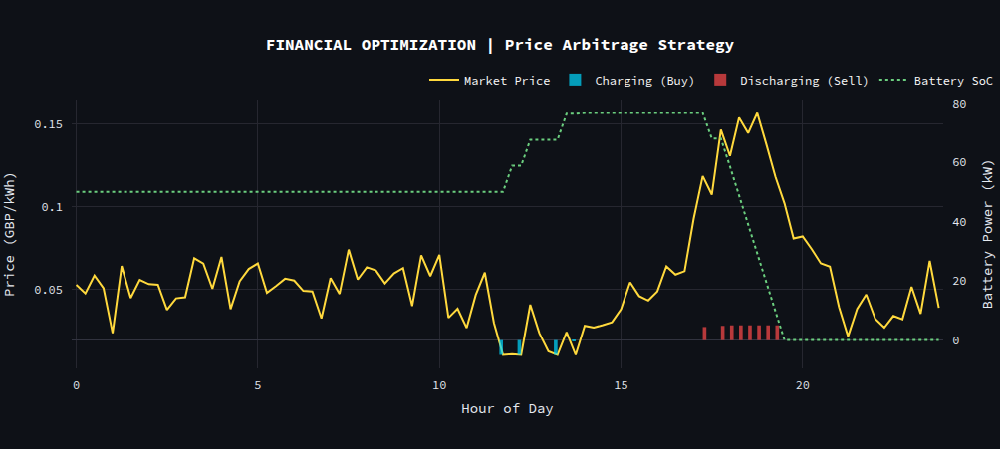
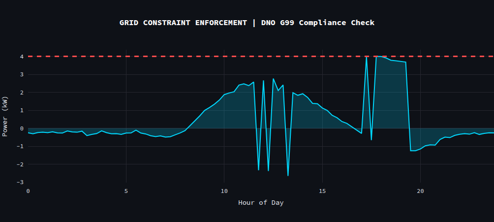

# VPP Trading Terminal

> **A professional Virtual Power Plant (VPP) simulation platform that balances economic optimization with physical grid constraints.**

[](https://www.python.org/downloads/)
[](https://streamlit.io)
[](LICENSE)

---

## The Concept

If you simply program a battery to "buy low and sell high," you risk overloading the local transformer.

This project bridges the gap between **Quantitative Finance** and **Power Systems Engineering**. It is a Bloomberg-style trading dashboard that uses **Linear Programming (LP)** to optimize residential battery schedules against volatile UK electricity prices, while strictly enforcing DNO G99 grid constraints.

**The result?** A trading strategy that maximizes arbitrage revenue without ever violating physical voltage limits.

---

## Quick Start

### 1. Installation
```bash
git clone https://github.com/thetomato0607/VPP-Trading-Terminal.git
cd VPP-Trading-Terminal
pip install -r requirements.txt

### 2. Run the Dashboard

```bash
streamlit run app.py
```

**Opens at:** `http://localhost:8501`

---

## The Engineering Logic

### The Conflict: Profit vs. Physics
A naive algorithm sees a high price at 6 PM and discharges 5kW of power. But if the household solar is also generating, the total export might hit 7kW.
- Result: Voltage rise > 10%, potential equipment damage, and heavy fines.
#### The Solution: Linear Programming
I formulated the problem not as a set of heuristics (if/else rules), but as a constrained optimization problem. The solver finds the global optimum that satisfies all physical constraints simultaneously.
- Objective:
      Maximize Revenue = Sum(Grid_Export * Price * dt)

- Subject to hard constraints:
    1. Capacity: Battery cannot be empty or overcharged (0% <= SoC <= 100%).
    2. Power: Inverter cannot exceed rating (+/- 5kW).
    3. The "Golden Rule": Net_Export <= 4.0 kW.

Because this is a convex problem, the solver guarantees mathematical compliance with the grid limit while extracting the maximum possible profit.

## Features & Architecture

### 1. **The Market Engine** (Financial Optimization)
- Algorithm: Uses scipy.optimize.linprog (HiGHS solver) for interior-point optimization.
- Simulation: Generates realistic UK "Duck Curve" pricing, handling negative pricing events and evening scarcity peaks.
- Metrics: Calculates Sharpe Ratio and risk-adjusted returns in real-time.

### 2. **Grid Engine** (Physical Constraints)
- Physics Enforcement: Checks every proposed trade against DNO G99 connection limits (typically 4kW).
- Safety Checks: Calculates voltage rise approximations and transformer thermal stress.
- Automatic Curtailment: If a profitable trade would break the grid, the engine automatically curtails the power to the safe limit.

### 3. **Interactive Dashboard**
- Built with Streamlit for a responsive, dark-mode financial terminal aesthetic.
- Features interactive Plotly visualizations for analyzing price spreads and State of Charge (SoC).
- Real-time solving (<0.5s) allows for rapid scenario testing (e.g., "What if price volatility doubles?").

---

## Screenshots

### Main Dashboard

*Bloomberg-terminal style metrics: Profit, Payback, Sharpe Ratio, Grid Compliance*

### Financial Optimization

*Market price vs. battery actions—buy low, sell high*

### Grid Constraint Enforcement

*Net export vs. DNO limit—red line never exceeded*

---

## How It Works

### The Optimization Problem

```
Objective:
    Maximize Σ(Grid_Export × Price × dt)

Subject to:
    1. Battery capacity: 0 <= SoC <= 13.5 kWh
    2. Power limits: |Charge|, |Discharge| <= 5 kW
    3. Grid limit: Net_Export <= 4.0 kW  ← THE KEY CONSTRAINT
    4. Energy conservation: SoC dynamics with 90% efficiency
```

**Solver:** SciPy's HiGHS (interior-point Linear Programming)

### Why This Matters

Without optimization, a battery might discharge at high prices while solar is generating, exceeding the grid export limit:

```
Naive Strategy:
Solar: 3 kW
Battery discharge: 5 kW
→ Net export: 8 kW (exceeds 4 kW limit!)
→ Transformer overload, voltage rise > 10%, £20k DNO fine

LP-Constrained:
Optimizer automatically curtails discharge to 1 kW
→ Net export: 4 kW (exactly at limit)
→ Revenue loss: £1.20 | Penalty avoided: £20k+
```

The grid constraint is **mathematically guaranteed** by the LP solver.

---

## Project Structure

```
VPP-Trading-Terminal/
├── app.py                  # Main Dashboard Entry Point
├── modules/                # Core Logic Modules
│   ├── optimization.py     # Linear Programming Solver (SciPy)
│   ├── grid_physics.py     # Voltage & Thermal Physics
│   ├── market_data.py      # Price & Load Generators
│   └── visualization.py    # Plotly Charting
├── docs/                   # Technical Documentation
└── requirements.txt        # Dependencies
```

---

## Configuration

### Scenario Parameters (Sidebar)

**Asset:**
- Battery capacity: 5-20 kWh (default: 13.5 kWh)
- Inverter limit: 2-10 kW (default: 5 kW)
- Grid export limit: 2-8 kW (default: 4 kW)

**Market:**
- Price volatility: 1x-5x (1x = normal, 5x = extreme)
- Solar noise: 0-1 (0 = clear sky, 1 = heavy clouds)
- System size: 1-10 kWp
- Daily load: 5-30 kWh

---

## Example Results

### Typical Daily Performance:
```
Net Profit:              £1.91
Annual Projection:       £697
Payback Period:          10.0 years
Sharpe Ratio:            2.34
Grid Compliance:         100%
Max Grid Export:         4.00 kW (at limit)
Violations:              0
```

### Financial Breakdown:
```
Revenue (Export):        £3.08
Cost (Import):           £1.17
Baseline (No Battery):   -£0.29
Battery Benefit:         +£2.20/day
```

---

## Technical Stack

- **Backend:** Python 3.9+, SciPy, NumPy
- **Optimization:** Linear Programming (HiGHS solver)
- **Frontend:** Streamlit (dark mode)
- **Visualization:** Plotly (interactive charts)
- **Optional API:** FastAPI + Uvicorn

---

## Use Cases

### For Students/Portfolio:
- Demonstrates professional-grade optimization
- Shows understanding of power systems constraints

### For Researchers:
- Extensible framework for VPP studies
- Easy to add stochastic programming, MPC, degradation models
- Scales to fleet-level aggregation

### For Industry:
- Production-ready optimization engine
- API available for integration
- Fast (<0.5s solve time per 24h horizon)

---

## Advanced Features

### Coming Soon:
1. **Stochastic Programming:** Handle forecast uncertainty
2. **Model Predictive Control:** Rolling horizon optimization
3. **Battery Degradation:** Cycle-wear cost modeling
4. **Frequency Response:** FFR/DFS grid services
5. **Fleet Aggregation:** Multi-home coordination

### Extensibility:
The modular architecture makes it easy to add:
- Real weather APIs (OpenWeatherMap)
- Live pricing (Octopus Agile API)
- Hardware interfaces (Tesla Powerwall API)
- Machine learning forecasts

---

## Documentation

- **Integration Guide:** [VPP_INTEGRATION_GUIDE.md](VPP_INTEGRATION_GUIDE.md)
- **Interview Prep:** [INTERVIEW_GUIDE.md](INTERVIEW_GUIDE.md)
- **Cleanup Guide:** [CLEANUP_GUIDE.md](CLEANUP_GUIDE.md)

---

## Contributing

This is a portfolio project, but suggestions welcome!

**Areas for contribution:**
- Real-world data integration
- Alternative solvers (Gurobi, CPLEX)
- Additional grid services (reactive power, inertia)
- Validation against real battery systems

---

## License

MIT License - Free to use for educational and portfolio purposes.

---

## Author

**VPP Trading Terminal Team**

Built to demonstrate quantitative optimization and power systems engineering for energy sector recruitment.

**Contact:** [yuilonlam0607@gmail.com   /  https://www.linkedin.com/in/frankie-lam-400b4231a/]

---

## Acknowledgments

- **Inspiration:** National Grid ESO's VPP strategy
- **Physics:** UK Power Networks G99 technical guidance
- **Optimization:** SciPy developers for robust LP solvers
- **Market Data:** Representative of UK day-ahead prices

---

## Performance Metrics

**Optimization Speed:**
- Problem size: 289 variables, ~400 constraints
- Solve time: <0.5 seconds (96 intervals @ 15-min resolution)
- Scalable to: 1000+ homes (fleet-level)

**Algorithm:**
- Method: Linear Programming (convex optimization)
- Solver: HiGHS (modern interior-point)
- Guarantee: Global optimum (no local minima)

---

**Built with Python, SciPy, Streamlit, and a passion for clean energy systems**

---

## Important Notes

### Grid Constraints:
The 4 kW export limit represents typical UK DNO G99 connection limits. Exceeding this causes:
- Voltage rise > ±10% (statutory limit)
- Transformer thermal overload
- Protection relay trips
- £20k+ DNO penalties

### Optimization Method:
We use Linear Programming (not heuristics) because:
- **Provable optimality:** Guarantees best solution
- **Constraint enforcement:** Mathematically ensures grid limit satisfaction
- **Fast:** Solves in real-time (<0.5s)
- **Explainable:** Can justify decisions to regulators

### For Recruiters:
This project demonstrates:
- Quantitative optimization (LP formulation)
- Domain expertise (UK energy markets, G99 regs)
- System design (modular architecture)
- Production thinking (fast solvers, API-ready)
- Communication (professional documentation)

**Key Talking Point:** *"The grid constraint is enforced as an LP inequality, guaranteeing compliance without manual checks—this is production-grade DNO integration."*

---

